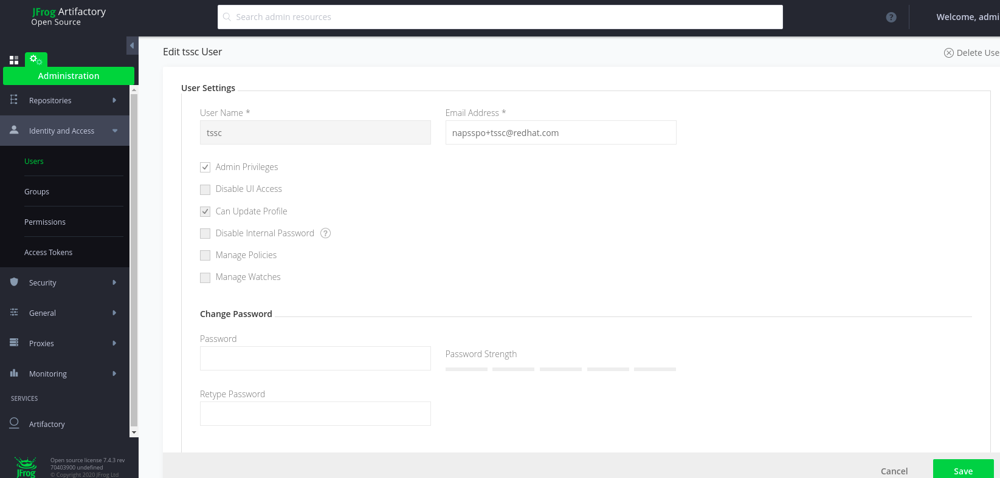

= Bootstrap Artifactory for TSSC

The purpose of this documentation is to provide the minimal bootstrapping steps to integrate with the TSSC Pipeline.   At minimum, one administration deed needs to be completed:  (1) add a user.

For the MVP, the user will have admin permissions. The pipeline will need to have the credentials.  For example, Jenkins will require the credentials and OpenShift will need a secret defined that can be accessed by Tekton.   The steps for integrating with Jenkins and Tekton are not covered in this document, however, be aware that the credentials will need to shared.

== Create user for TSSC Pipeline

. Log in to Artifactory server as an admin user
. **Administration -> Identity and Access -> Users**
. Create a user that can create projects from the command line interface.
. Ensure the new user has the "Admin Privileges"
+
