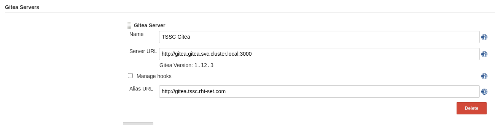
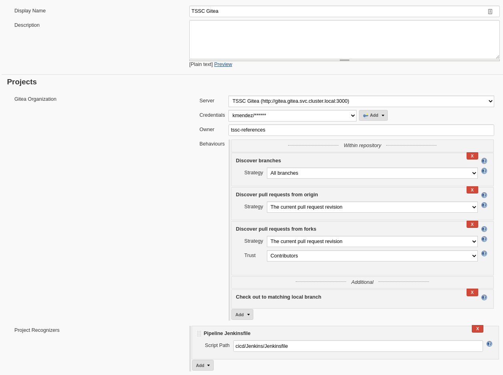
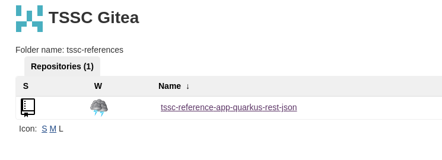
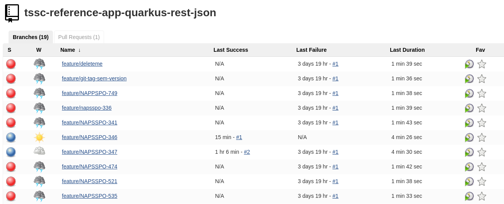
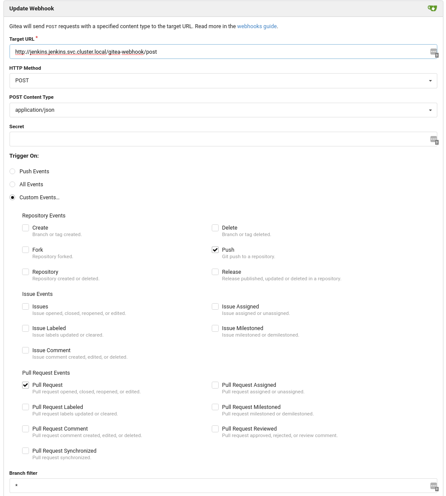
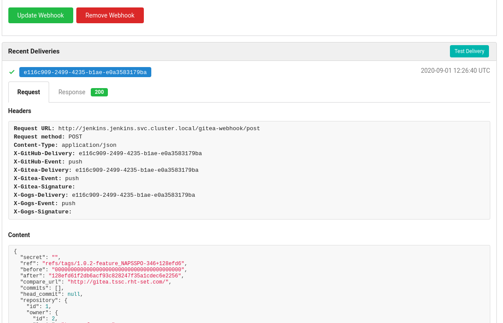

== Pre-Requisites

Update with:
 - Save webhook -> Add webhook
    - No Test delivery function until after saving and revisiting page

. Jenkins and Gitea are installed. Refer to their respective installation guides within this repository:
+
   * link:../Gitea/install.adoc[Deploy Gitea]
   * link:../jenkins/install.adoc[Deploy Jenkins]
+
. A code repository has been created in Gitea and it is configured with Jenkinsfiles

= Gitea Jenkins Integration

The following sections describe how to integrate Jenkins and Gitea such that events in Gitea (e.g., pull request creation / edit / merge, code pushes) result in corresponding pipelines being run in Jenkins automatically. Gitea will also be aware of the status of these pipelines.

== Install and configure Jenkins plugins

. Log in to jenkins as an admin user
. **Manage Jenkins -> Manage Plugins -> Available**
. Install the following required Jenkins plugins by searching for them, selecting them, and then selecting **Download now and install after restart**
  * Pipeline: Multibranch
  * Gitea Plugin
. After jenkins restarts, log back in
. ** Manage Jenkins -> Configure System** navigate to the **Gitea Server** section
. Enter the parameters appropriate for the Gitea server. Click the `Advanced` button to set the alias URL. The alias must be set to the Gitea public url. See example below.
+

+
. Create an access token (and copy / save the value) in Gitea for the jenkins account via the Gitea UI: **Settings -> Applications -> Generate New Token**. Make sure it has access to the organization / repository containing the source code.
. From the main screen in jenkins select **New Item** of type **Gitea Organization**
+
   * Set the name field to a descriptive name, e.g. *TSSC Gitea*
   * Set the owner to the name of the organization in Gitea, e.g., *tssc-references*. This **MUST** match the organization name in Gitea exactly.
   * Create a *Gitea Organization Credential* (via the dropdown) using the application token created above
   * Add an additional behavior **Check out to matching local branch**
   * Make sure the script path is set correctly, e.g. cicd/Jenkins/Jenkinsfile
+

+
. Save the Gitea organization item. It will automatically discover all branches and initiate pipelines. You can manually stop the pipelines if desired.
+

+

== Create webhook in Gitea
. Log in to Gitea and navigate to the code repository. Navigate to **Settings -> Webhooks**
+ Fill in the parameters. The target url should point to the http://*your-jenkins-instance-address*/gitea-webhook/post. For "Trigger On", select "Custom Events..."  and "Push" and "Pull Request". See the example below.
+

+
. Save the webhook by selecting "Add Webhook".
. Select the webhook you just created and click the **Test Delivery** button to verify the hook is successfully sent to Jenkins. Click the successful test to view the contents. Verify the Gitea url referenced in the payload matches the url set as an alias within Jenkins in the previous section.
+

+
. Try creating a new branch and verify it is added to Jenkins and a corresponding pipeline is created.
+
. If the pipeline is not automatically created for the branch and started:
+
   * Verify the **alias** set for the Gitea server matches the public Gitea URL.
   * Verify the **owner** set for the Gitea organization in Jenkins exactly matches the organization name in Gitea.