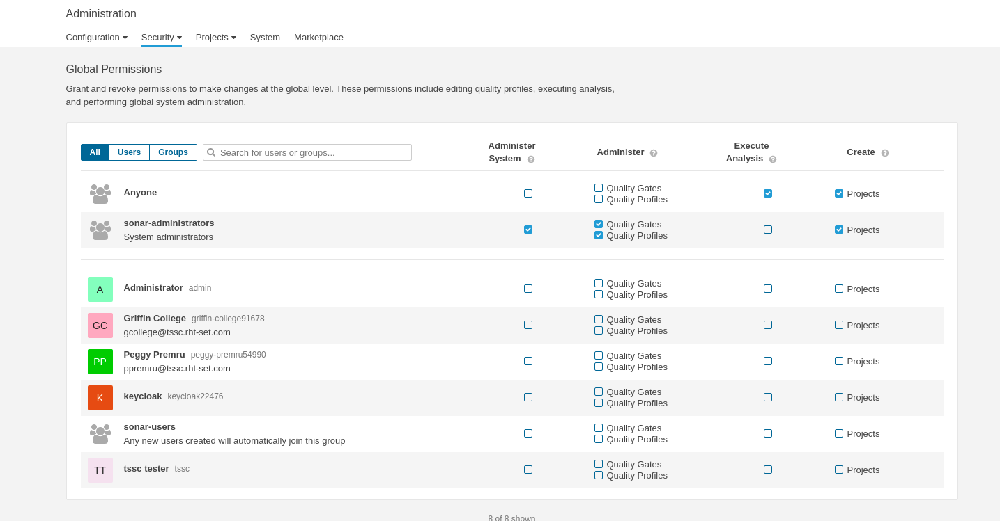

= Bootstrap SonarQube for TSSC

The purpose of this documentation is to provide the minimal bootstrapping steps required to integrate with the TSSC Pipeline.   At minimum, two administration deeds will need to be completed:  (1) add a user and (2) add a code analyzer. 

For the MVP, the user will have admin permissions and the code analyzer will be Java.   The pipeline will need to have the credentials.  For example, the Jenkins server  will require the credentials and OpenShift will need a secret defined that can be accessed by Tekton.   The steps for integrating with Jenkins and Tekton are not covered in this document, however, be aware that the credentials will need to be shared.

== Create user for TSSC Pipeline

. Log in to SonarQube server as an admin user
. **Administration -> Security -> User -> Create User**
. Create a user that can create projects from the command line interface.
. Ensure the new user has the ability to execute analysis and create projects OR provide execute analysis and create projects to "Anyone"
. **Administration -> Security -> Global Permissions**
+

== Install Java Code Analyzer

. Log in to SonarQube server as an admin user
. **Administration -> Marketplace**
. Search Plugins for "Java Code Quality and Security"
. Install the plugin
+
image::images/sonar_marketplace.png[Add SonarQube User]
